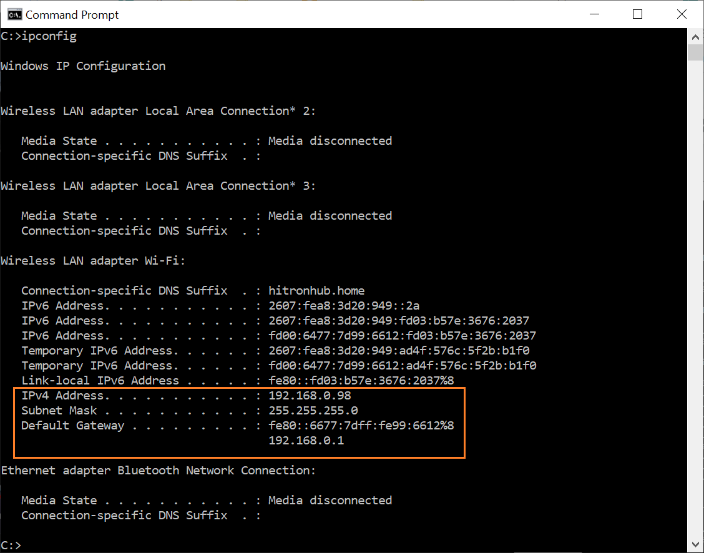

# ros2_vicon

`ros2_vicon` is a ROS2 Vicon that retrieves data from Vicon software and
publishes it on ROS2 topics


## Prerequisits

Find the IP address of the computer running Vicon Tracker software via `ipconfig` in the
command-prompt in windows. 

<p align="center">

</p>

## Usage

Clone `ros2_vicon`, download VICON DataStream SDK and run:

```
# Clone
cd <colcon workspace>/src
git clone https://github.com/chutsu/ros2_vicon

# Download VICON DataStream SDK locally
cd ros2_vicon && make deps

# Build ros2_vicon
cd <colcon workspace>
colcon build

# Run
source install/setup.bash
ros2 run ros2_vicon --ros-args -p hostname:=<ip address of vicon tracker>
```

## LICENCE

MIT
